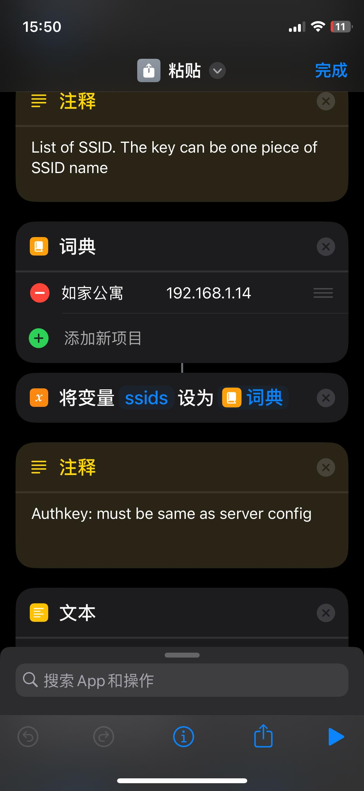

# iClipboard

  
  <h1 style="display: inline-block; vertical-align: middle;">iClipboard</h1>

 

iClipboard provides LAN clipboard sharing between Linux and IOS, and does not require any software to be installed in IOS, just a pair Shortcut.

- [ ] Implementing of windows support. (currently support in code but no tested)

# Setup
## Linux (server)

1. download [executable](https://github.com/Sologala/iClipboard/releases) 
2. unzip and run `./iClipboard`. 

## IOS
### For iOS users

1. Setup shortcuts on you iPhone/iPad (Open link from safari)
    - Copy:
      - iCloud: [https://www.icloud.com/shortcuts/f463a1e431c94c60b8a5c65305eb819f](https://www.icloud.com/shortcuts/f463a1e431c94c60b8a5c65305eb819f)
      - 
    - Paste:
      - iCloud: [https://www.icloud.com/shortcuts/90e7a2af70df4707a17dece8c263afc5](https://www.icloud.com/shortcuts/90e7a2af70df4707a17dece8c263afc5)
      - 
2. set wifi ssid and server ip both for `Copy` and `Paste` shortcut.

here is a example.

# Usage
## copy from linux to ios

1. copy or make a screenshot in linux.
2. run `Copy` shortcut in ios. then you can paste the thing to anywhere.

## copy from ios to linux
1. copy the thing in ios and run `Past` shortcut in ios
2. paste in linux.

# Ref
> https://github.com/YanxinTang/clipboard-online

> the difference between `iClipboard` and `clipboard-online` is that former provide linux local clipboard shareing and the latter is only for windows platform. 

